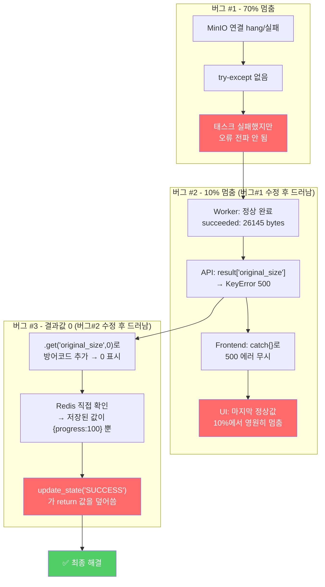

# 🔎 이미지 압축 서비스 디버깅 - 전체 과정 해설

> **날짜**: 2026-05-27
> **프로젝트**: JpegDownload

---

이 문서는 이미지 압축 웹서비스에서 발생한 **연쇄적인 3개의 버그**를 어떻게 발견하고 해결했는지, 단계별 사고 과정을 상세히 기록한 것입니다.

---

## 전체 구조 먼저 이해하기

### 서비스 구성

```
브라우저 (React)
    │  POST /api/compress (파일 업로드)
    ▼
FastAPI 서버 ──▶ Redis (메시지 브로커) ──▶ Celery Worker
    │                                            │
    │  GET /api/status/{id} (폴링)               │ 압축 처리
    │                                            │
    ◀──────────── Redis (결과 저장소) ◀──────────┘
```

### 데이터 흐름

1. 사용자가 이미지 업로드 → React가 FastAPI로 전송
2. FastAPI가 Celery 태스크 ID 발급 → Redis에 태스크 등록
3. Worker가 Redis에서 태스크 수신 → 압축 수행 → 결과를 Redis에 저장
4. React가 1초마다 `GET /api/status/{id}` 호출하여 진행 상황 확인
5. 완료되면 `GET /api/download/{id}` 호출하여 파일 다운로드

---

## 🐛 버그 #1: 70%에서 멈춤

### 현상
이미지 업로드 후 "이미지 압축 중... 70%" 에서 영원히 멈춤. 오류 메시지 없음.

### Step 1: 70%가 무슨 의미인지 소스코드에서 확인

`backend/app/tasks/image_tasks.py` 의 태스크 함수를 열어보면, 진행률이 단계별로 설정되어 있다:

```python
self.update_state(state="PROCESSING", meta={"progress": 10})   # 태스크 시작
# ... 이미지 정보 읽기 ...
self.update_state(state="PROCESSING", meta={"progress": 30})   # 정보 읽기 완료
# ... 압축 수행 ...
self.update_state(state="PROCESSING", meta={"progress": 70})   # 압축 완료 ← 여기서 멈춤
# ... 저장 ...
self.update_state(state="PROCESSING", meta={"progress": 90})   # 저장 완료
# ... 완료 ...
self.update_state(state="SUCCESS", meta={"progress": 100})     # 최종 완료
```

**→ 추론**: 70%에서 멈췄다는 것은 **압축 자체는 성공**했고, 그 다음 **저장 단계에서 문제**가 생겼다는 뜻이다.

### Step 2: 70% 이후의 코드를 정밀 분석

```python
self.update_state(state="PROCESSING", meta={"progress": 70})

# ===== 여기서부터 저장 단계 =====
minio_client = get_minio_client()           # MinIO 연결
minio_client.bucket_exists(bucket_name)     # 버킷 확인
minio_client.put_object(...)                # 파일 업로드
```

발견한 문제점들:
- MinIO라는 **외부 서비스에 의존**하고 있다
- 네트워크 통신이 필요한데 **try-except가 전혀 없다**
- MinIO 연결이 실패하거나 응답이 없으면(hang) → 예외 발생 → 그대로 태스크 종료
- UI에는 오류 표시도 안 되고, 70%에서 영원히 멈춘 것처럼 보임

### Step 3: 판단과 조치

MinIO 연결 문제를 디버깅하는 것보다, **아예 MinIO 의존성을 제거**하는 게 더 근본적인 해결책이라고 판단했다. 작은 프로젝트에서 오브젝트 스토리지까지 쓸 필요가 없기 때문.

**변경**: MinIO → 로컬 파일 시스템 (Docker 공유 볼륨으로 Worker↔API 파일 공유)

---

## 🐛 버그 #2: 10%에서 멈춤 (버그 #1 수정 직후)

### 현상
MinIO를 제거하고 재배포했더니, 이번에는 **10%** 에서 멈춘다.

### Step 1: "누가 범인인가?" — 문제의 소재 파악

10%에서 멈춘다는 건 두 가지 가능성이 있다:

| 가능성 | 의미 | 확인 방법 |
|--------|------|-----------|
| **A** | Worker가 실제로 10%에서 죽었다 | Worker 로그 확인 |
| **B** | Worker는 정상 완료했지만, API가 결과를 못 읽는다 | API 로그 확인 |

### Step 2: Worker 로그 확인 → 가능성 A 제거

```bash
$ docker logs img-compress-worker --tail 50
```

```
[2026-05-27 06:35:51] Task compress_image_task[d3fb1d3a-...] received
[2026-05-27 06:35:51] Task compress_image_task[d3fb1d3a-...] succeeded in 0.07s:
  'original_size': 26145,
  'compressed_size': 10588,
  'ratio': 2.5,
  'filename': 'compressed.jpg'
```

→ **Worker는 0.07초 만에 정상 완료!** `original_size`, `compressed_size`, `ratio`까지 완벽하게 계산됐다. 가능성 A는 아니다.

### Step 3: API 서버 로그 확인 → 진짜 범인 발견

```bash
$ docker logs img-compress-backend --tail 50
```

```
File "/app/app/api/compress.py", line 80, in get_status
    original_size=result["original_size"],
KeyError: 'original_size'
```

→ API 서버가 `GET /api/status/{id}` 요청을 처리할 때, `result["original_size"]` 에서 **KeyError** 가 발생했다. Worker는 분명히 값을 반환했는데, API 쪽에서는 키를 찾을 수 없다는 뜻이다.

### Step 4: 왜 KeyError가 발생하는가? — 가설 세우기

Worker가 반환한 dict:
```python
{'original_size': 26145, 'compressed_size': 10588, 'ratio': 2.5, ...}
```

이 데이터는 Redis에 저장되었다가, API가 `AsyncResult(task_id).result`로 다시 읽어온다. 이 과정에서 **Celery의 JSON 직렬화/역직렬화**를 거치는데, 여기서 무언가 잘못되고 있을 가능성이 있다.

### Step 5: 프론트엔드가 왜 멈춰 보이는가?

프론트엔드의 폴링 코드를 확인했다:

```typescript
// frontend/src/hooks/useCompression.ts
setInterval(async () => {
  try {
    const result = await checkStatus(task_id);
    // ... 상태별 처리 ...
  } catch {
    // ← 모든 오류를 조용히 무시!
  }
}, 1000);
```

**이 `catch {}`가 두 번째 범인**이었다:

- API가 500 에러를 반환 → `checkStatus()`에서 예외 발생
- `catch {}` 가 예외를 **완전히 무시**
- UI는 마지막 정상 응답인 `progress: 10` 을 그대로 표시
- 사용자 입장에서는 "10%에서 멈췄다"고 보임

### Step 6: 임시 조치

아직 KeyError의 근본 원인은 모르지만, 최소한 사용자에게 상황이 보이도록:

```python
# API: 방어적 코드 (KeyError 대비)
original_size=result.get("original_size", 0),   # 키 없으면 0
```

```typescript
// 프론트엔드: 3회 연속 오류 시 에러 표시
let errorCount = 0;
} catch {
    errorCount++;
    if (errorCount >= 3) {
        showError("서버 연결이 원활하지 않습니다");
    }
}
```

---

## 🐛 버그 #3: 결과가 전부 0으로 표시 (버그 #2 수정 직후)

### 현상
이제 "압축 완료"까지는 뜨지만, **원본 크기=0, 압축 후=0, 압축률=0** 으로 표시된다.

### Step 1: 0이 나오는 이유

버그 #2에서 `result.get("original_size", 0)` 방어 코드를 넣었다. 0이 나온다는 건 **Redis에 저장된 결과에 'original_size' 키 자체가 없다**는 뜻이다.

### Step 2: Redis에 저장된 실제 데이터를 직접 확인 — 결정적 단서!

이제 더 이상 추측하지 않고, **Redis 안에 무엇이 저장되어 있는지 직접 들여다보기로 한다**.

```bash
# 1. Redis에 저장된 Celery 키 목록 조회
$ docker exec img-compress-redis redis-cli KEYS "celery-task-meta-*"
celery-task-meta-d3fb1d3a-6704-4183-9032-32089ed6e7db
celery-task-meta-3a9d05e6-bfcb-43e4-9c0f-43b86feb30b5

# 2. 실제 저장된 값 확인
$ docker exec img-compress-redis redis-cli GET "celery-task-meta-d3fb1d3a-..."
```

**Redis에 저장된 실제 데이터:**
```json
{
    "status": "SUCCESS",
    "result": {"progress": 100},
    "traceback": null,
    "children": [],
    "date_done": "2026-05-27T06:35:51.102309+00:00",
    "task_id": "d3fb1d3a-6704-4183-9032-32089ed6e7db"
}
```

### Step 3: 충격 — 예상과 완전히 다르다!

Worker 로그에는 분명히 이렇게 찍혔다:
```
succeeded: {'original_size': 26145, 'compressed_size': 10588, 'ratio': 2.5, ...}
```

그런데 Redis에는 `{"progress": 100}` 만 덩그러니 있다. `original_size`, `compressed_size`, `ratio`는 흔적도 없다.

### Step 4: 코드에서 범인 특정

"progress: 100" 이라는 값 — 이게 어디서 왔을까?

태스크 코드의 마지막 부분을 다시 보면:

```python
# image_tasks.py 의 compress_image_task 함수

result = {
    "task_id": task_id,
    "original_size": original_size,    # 26145
    "compressed_size": compressed_size, # 10588
    "ratio": ratio,                     # 2.5
    "original_info": original_info,
    "filename": f"compressed.{file_ext}",
}

self.update_state(state="SUCCESS", meta={"progress": 100})  # ← 범인!!!
return result  # ← 이 값은 Redis에 저장되지 않는다!
```

### Step 5: Celery의 `self.update_state()` 동작 원리

Celery에서 `self.update_state(state="SUCCESS", meta={...})`를 호출하면 **"태스크가 이미 성공적으로 끝났다"** 라고 Celery에게 알리는 것이다. 이 시점에 `meta` 값이 Redis에 최종 결과로 저장된다.

그 후 `return result`를 해도, Celery는 "이미 SUCCESS로 끝난 태스크인데?" 라고 판단하고 **return 값을 무시**한다.

| 코드 | Celery의 해석 | Redis 최종 저장값 |
|------|--------------|-------------------|
| `update_state("SUCCESS", meta={"progress":100})` + `return result` | "아, 이미 SUCCESS로 끝났구나. meta를 결과로 저장할게" | `{"progress": 100}` |
| `return result` 만 사용 | "태스크가 정상 종료됐네. return 값을 결과로 저장할게" | `{"original_size": 26145, ...}` |

### Step 6: 최종 수정

```python
# 변경 전 (버그)
self.update_state(state="SUCCESS", meta={"progress": 100})
return result

# 변경 후 (정상)
return result  # Celery가 자동으로 SUCCESS 처리 + return 값을 결과로 저장
```

---

## 📊 3개 버그의 연쇄 관계도



---

## 🧠 디버깅에서 배운 교훈

### 1. "어디까지 성공했는가" 로 범위 좁히기
70% → 10% → 결과값 0. 매번 **진행률 값**이 힌트였다. 70%는 "압축 후 저장 직전", 10%는 "태스크 시작 직후". 이 정보만으로도 어느 코드 라인에서 문제가 생겼는지 대략 알 수 있었다.

### 2. 로그를 양쪽 다 확인하기
Worker와 API 서버는 **다른 프로세스**다. Worker 로그만 봤다면 "태스크 성공했네, 문제없다"라고 오판했을 것이다. **API 로그를 함께 확인**해서 KeyError를 발견했다.

### 3. "무시하는 코드"가 버그를 숨긴다
프론트엔드의 `catch {}` 는 당장은 편리하지만, 진짜 오류까지 삼켜버린다. 폴링처럼 반복되는 비동기 처리는 **일정 횟수 이상 연속 실패하면 반드시 사용자에게 알려야** 한다.

### 4. 추측하지 말고 실제 데이터를 보라
버그 #3의 진짜 원인(`update_state`가 return을 덮어쓰는 것)은 **코드만 봐서는 절대 알 수 없었다**. Redis에 실제로 무엇이 저장되어 있는지 `redis-cli GET` 으로 직접 확인했기 때문에 발견할 수 있었다. "중간 저장소"가 있는 시스템을 디버깅할 때는 **그 안에 뭐가 들었는지 직접 보는 것**이 가장 확실한 방법이다.

### 5. 하나를 고치면 다음 버그가 드러난다
연쇄적인 버그의 전형적인 패턴:
- 버그 #1(MinIO)이 #2(KeyError)를 가리고 있었다
- 버그 #2(KeyError)가 #3(update_state)를 가리고 있었다
- 각각 해결할 때마다 다음 레이어가 드러났다

이런 상황에서는 **"또 문제네"라고 좌절하지 않고, "이전 버그가 가리고 있던 게 드러난 거구나"** 라고 생각하는 게 중요하다.
