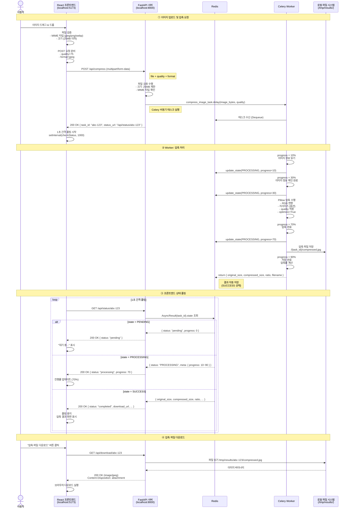
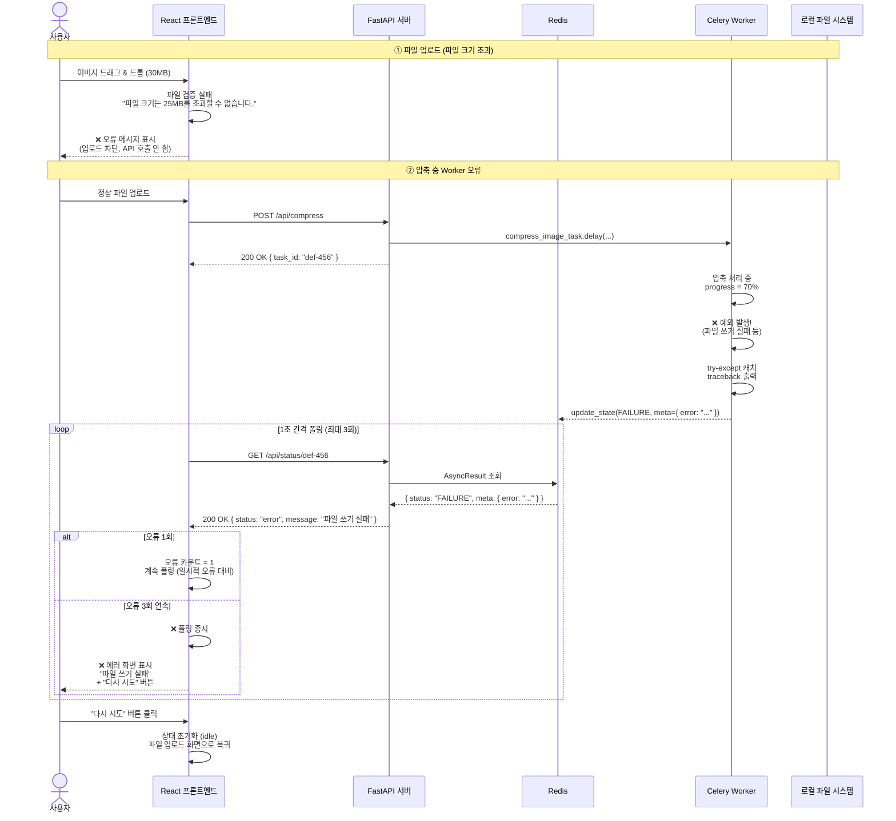
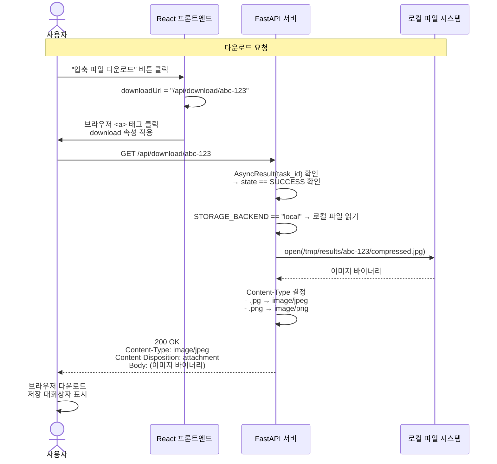
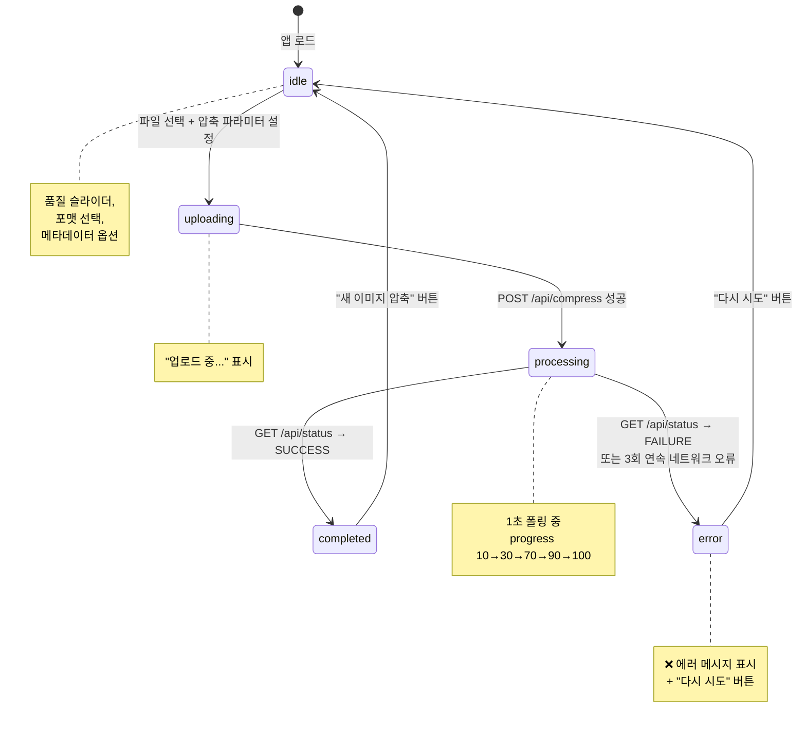
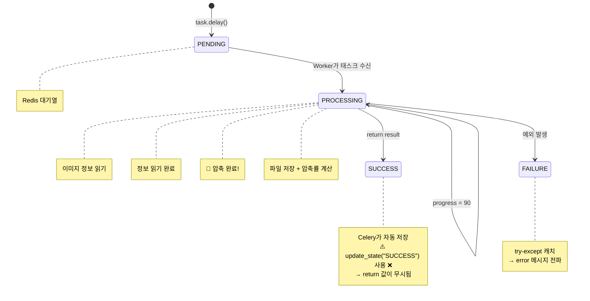

# 🔄 이미지 압축 서비스 — 전체 시퀀스 다이어그램

> **작성일**: 2026-05-27

---

## 1. 이미지 업로드 및 압축 (정상 흐름)



---

## 2. 오류 발생 흐름



---

## 3. 다운로드 흐림 (로컬 스토리지)



---

## 4. 프론트엔드 내부 상태 전이



---

## 5. Celery 태스크 내부 상태 전이



---

## 6. 전체 시스템 구성도

```mermaid
flowchart LR
    subgraph "사용자"
        Browser["브라우저<br/>(React SPA)"]
    end

    subgraph "Docker 네트워크"
        subgraph "프론트엔드"
            if_dev[["개발: Vite Dev Server<br/>:5173"]]
            if_prod[["본방: Nginx<br/>:80"]]
        end

        subgraph "백엔드"
            API["FastAPI<br/>(Gunicorn+Uvicorn)<br/>:8000"]
            Worker["Celery Worker<br/>concurrency=2"]
        end

        subgraph "인프라"
            Redis[("Redis<br/>:6379")]
            FS[("공유 볼륨<br/>results-data<br/>/tmp/results")]
        end
    end

    Browser -->|:80 or :5173| if_dev
    Browser -->|:80| if_prod

    if_prod -->|"/api" 프록시| API
    if_dev -->|"/api" 프록시| API

    API -->|task.delay()| Redis
    API -->|read_file| FS

    Worker -->|dequeue| Redis
    Worker -->|write_file| FS
    Worker -->|result 저장| Redis

    API -->|상태 조회| Redis

    style if_dev stroke-dasharray: 5 5
    style FS fill:#e8f5e9
    style Redis fill:#fff3e0
```

---

## 7. 핵심 포인트 요약

### 정상 흐름의 4단계
1. **업로드** → React → FastAPI → Celery task 생성
2. **압축** → Worker가 Redis에서 태스크 수신 → Pillow 압축 → 파일 저장
3. **폴링** → React가 1초마다 API로 상태 확인 (10%→30%→70%→90%→100%)
4. **다운로드** → API가 로컬 파일 읽어서 반환 → 브라우저 다운로드

### 오류 처리
- **파일 검증 실패**: API 호출 전 프론트엔드에서 차단
- **Worker 예외**: try-except로 캐치 → FAILURE 상태 → 폴링에서 감지
- **네트워크 오류**: 3회 연속 실패 시 프론트엔드가 에러 표시

### 과거 버그에서 배운 점
- ⚠️ `self.update_state(state="SUCCESS")` → **절대 사용 금지** → return 값이 무시됨
- ⚠️ `catch {}` → **절대 빈 핸들러 금지** → 버그가 숨음
- 💡 Redis 데이터는 `redis-cli GET` 으로 직접 확인하라
